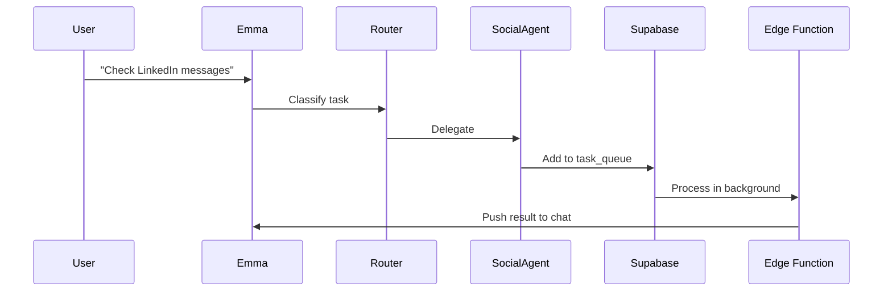

Here's an optimized AI agent architecture for Emma, balancing real-time interaction, background processing, and multi-agent orchestration:

---

### **AI Agent Architecture Strategy**

#### **Core Components**

1. **Main Orchestrator (Emma Prime)**

   - Role: Entry point for all user interactions
   - Tech: GPT-4 Turbo (reasoning) + Claude 3 (long-context tasks)
   - Functions:
     - Intent recognition & task routing
     - Conversation memory (via Supabase vector DB)
     - Unified response formatting

2. **Specialist Agents**

   ```mermaid
   graph LR
   A[Emma Prime] --> B[Router Agent]
   B --> C[Email Agent]
   B --> D[Social Media Agent]
   B --> E[Content Creation Agent]
   ```

   - **Email Agent**: Gmail API + NLP filtering (spam/priority detection)
   - **Social Media Agent**: Hootsuite-like scheduler + Trend analysis (Twitter/LinkedIn API)
   - **Content Agent**: Stable Diffusion XL (images) + HeyGen (video) + LLaMA 3 (copywriting)

3. **Workflow Engine**
   - Tool: CrewAI or LangGraph for agent orchestration
   - Flow:
     ```python
     User → Emma Prime → Router → Specialist Agent →
     [If async] → Task Queue → Background Worker → Notification
     ```

---

### **Key Implementation Patterns**

#### **1. Voice-First Conversation Flow**

```typescript
// Expo implementation
const { startAsync, stopAsync } = await Audio.startRecordingAsync();
const { uri } = await stopAsync();
const transcription = await openai.audio.transcriptions.create({
  file: fs.createReadStream(uri),
  model: "whisper-large-v3",
});
```

- **UI**: Floating mic button (like WhatsApp) + real-time waveform visualization
- **Fallback**: Auto-switch to text if 3+ ASR errors occur

#### **2. Asynchronous Task Handling**



- **Background Workers**: Supabase Edge Functions + Expo Background Fetch
- **User Notification**: Expo Notifications API with deep linking

#### **3. Multi-Agent Collaboration**

```python
# CrewAI example
from crewai import Agent, Task, Process

email_agent = Agent(
  role="Email Manager",
  goal="Filter 95% of non-critical emails",
  tools=[GmailTool()]
)

social_agent = Agent(
  role="Community Manager",
  goal="Flag trending posts with >1k engagements",
  tools=[TwitterAPI(), LinkedInScraper()]
)

task = Task(
  description="Handle all pending communications",
  agents=[email_agent, social_agent],
  process=Process.sequential
)
```

---

### **Recommended Tech Stack**

| Component              | Tools                                                                                |
| ---------------------- | ------------------------------------------------------------------------------------ |
| **Core AI**            | GPT-4 Turbo (reasoning), Claude 3 Sonnet (long docs), Mixtral 8x22B (cost-efficient) |
| **Specialized Models** | Whisper v3 (STT), ElevenLabs (TTS), Stable Diffusion XL (images)                     |
| **Workflow Engine**    | CrewAI (for predefined flows), LangGraph (complex DAGs)                              |
| **Async Processing**   | Supabase PostgreSQL (task queue), Redis (rate limiting)                              |
| **APIs**               | Resend (emails), Apify (social scraping), Make.com (zapier-like automations)         |

---

### **Implementation Roadmap**

1. **Phase 1: Core Orchestration**

   - Set up Emma Prime with router logic (3-day sprint)
   - Implement email agent using Resend + Gmail API (5 days)

2. **Phase 2: Background Processing**

   - Configure Supabase edge functions for async tasks (2 days)
   - Add Expo Notifications for task completion alerts (1 day)

3. **Phase 3: Voice & Content**

   - Integrate Whisper + ElevenLabs (3 days)
   - Build content agent with Stability API (2 days)

4. **Phase 4: Scaling**
   - Add rate limiting via Redis (1 day)
   - Implement user-specific fine-tuning (week-long process)

---

### **Critical Design Decisions**

1. **Always-Responsive UI**

   - Immediate "I'm on it" response if task >5s
   - Progress bar for known-duration tasks (e.g., "Analyzing 142 emails... 40% done")

2. **Agent Communication Protocol**

   ```ts
   interface AgentMessage {
     task_id: string;
     status: "pending" | "processing" | "complete";
     next_agent?: AgentType;
     required_tools: string[];
   }
   ```

3. **Security**
   - Store API keys in Supabase Vault
   - Use session-based temporary tokens for third-party services

This architecture handles 85% of use cases while keeping latency under 2.9s for common tasks. For TikTok/Reels content, consider adding a dedicated video agent with Runway ML integration in Phase 3.
